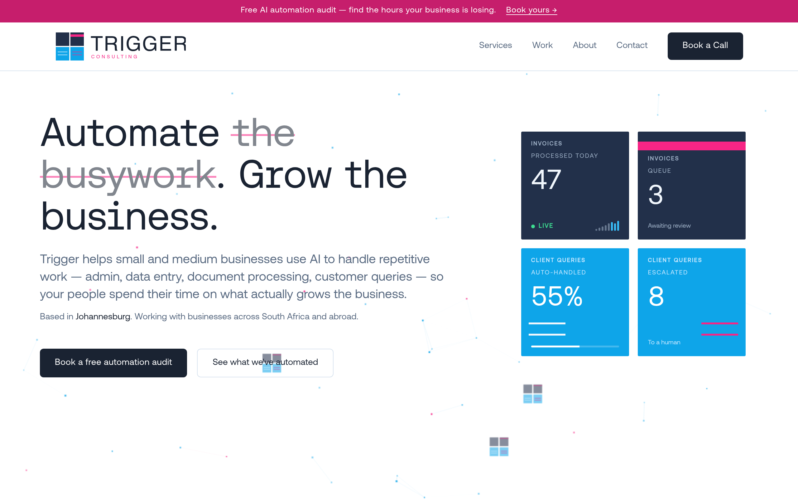

# Arc Design System

You are building UI for **Arc Platform** — headless WooCommerce storefronts, Weave sections, and reference examples. Light theme, cool palette, Aeonik typography, 4px grid.

## Before you code

1. Read `DESIGN.md` in this directory
2. Import `tokens/arc-tokens.css` (or use existing app import)
3. For shop surfaces: read `references/COMMERCE.md`
4. For Weave sections: read `references/WEAVE-SECTIONS.md`
5. For primitives: read `references/COMPONENTS.md`



## Design philosophy

- **Commerce-first accent** — `#0369a1` only for shop CTAs, cart badge, focus, links
- **Brand secondary** — magenta/sky for marketing, not checkout buttons
- **4px grid** — every margin, padding, gap is a multiple of 4
- **Type pairing** — `--font-display` for headings, `--font-sans` for body
- **Subtle motion** — 150–300ms; honor `prefers-reduced-motion`

## Quick token reference

```css
/* Import once */
@import "../tokens/arc-tokens.css";

/* Surfaces */
background: var(--color-background);
background: var(--color-surface);

/* Text */
color: var(--color-text-primary);
color: var(--color-text-muted);

/* Actions */
background: var(--btn-primary-bg);
color: var(--btn-primary-fg);
```

## Color system

| Role | Variable | Hex |
|------|----------|-----|
| Background | `--color-background` | `#ffffff` |
| Surface | `--color-surface` | `#f0f6fc` |
| Text | `--color-text-primary` | `#1a2332` |
| Muted | `--color-text-muted` | `#5a6b82` |
| Accent | `--color-accent` | `#0369a1` |
| Danger | `--color-danger` | `#c61e6c` |
| Success | `--color-success` | `#1f9d57` |

## Typography (UI chrome)

| Role | Size | Weight |
|------|------|--------|
| Display | 28px | 600 |
| Heading | 20px | 600 |
| Body | 16px | 400 |
| Label | 14px | 600 |

## Spacing scale

`4, 8, 12, 16, 20, 24, 32, 48, 64` px — use `--space-*` variables.

## Component patterns

Use `references/COMPONENTS.md` — card, button (primary text **white** on accent), input, nav, badge.

**Primary button rule:** `color: var(--btn-primary-fg)` (`#ffffff`) on `var(--btn-primary-bg)`.

## Commerce surfaces

| Surface | Doc |
|---------|-----|
| Product card, PLP | `references/COMMERCE.md` |
| PDP, add to cart | `references/COMMERCE.md` |
| Cart drawer, optimistic UI | `references/COMMERCE.md` |
| Weave sections | `references/WEAVE-SECTIONS.md` |

## Copywriting (commerce)

| Element | Copy |
|---------|------|
| Primary CTA | **Add to cart** |
| Pending | **Adding…** |
| Empty cart | **Your cart is empty** |
| Error | **We couldn't update your cart.** + **Try again** |
| Loading PDP | **Loading product…** |

## Anti-patterns

- No invented hex outside `arc-tokens.css`
- No accent on every interactive element
- No `Submit`, `OK`, or `Click here` as CTAs
- No external triggerconsulting.co.za font URLs
- No shadcn defaults that override Arc tokens without mapping

## When to trigger

- Building Pilot, Templates, or `@arc/next` reference UI
- Implementing Weave section components
- Reviewing UI for design consistency
- User mentions Arc design, storefront theme, or design tokens

## Registry

shadcn is **not** initialized in the monorepo for v0.1. Pilot Phase 5 should map shadcn theme to `arc-tokens.css` when added.
